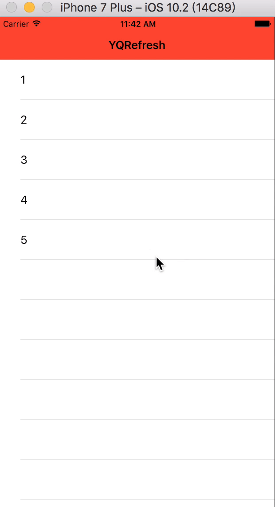

# YQRefresh

前几天在简书写了[MJRefresh的原理探究](http://www.jianshu.com/p/ff59b646fc02),写完后自己就打算写一个自己的上下拉刷新控件，算是对于自己学习的总结

过年杂事繁多，只是完成了基础部分，效果如下：




## 使用
使用很简单，用以下代码就可以了

```
__weak __typeof(self)weakSelf = self;
    
    //下拉刷新
    headerView = [mTableView addHeaderWithRefreshHandler:^(YQRefreshBaseView *refreshView) {
        [weakSelf refreshAction];
    }];
    
    //上拉加载更多
    footerView = [mTableView addFooterWithRefreshHandler:^(YQRefreshBaseView *refreshView) {
        [weakSelf loadMoreAction];
    }];
    
    //自动刷新
    footerView.autoLoadMore = self.autoLoadMore;


```

## More
年后有时间再把其他动画特效添加上去